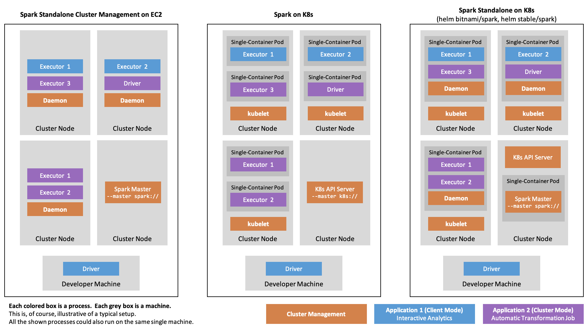
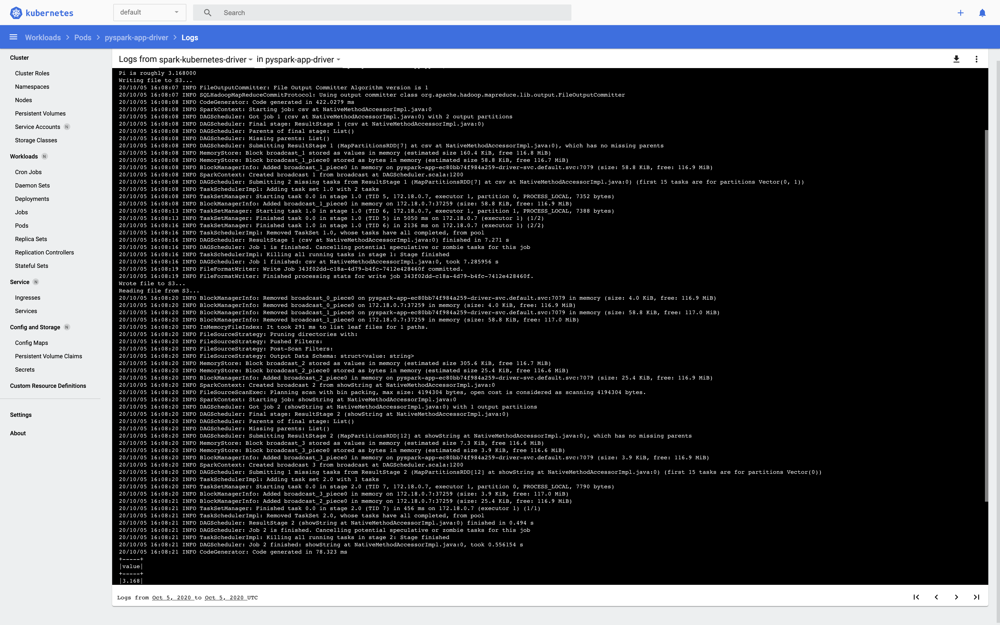
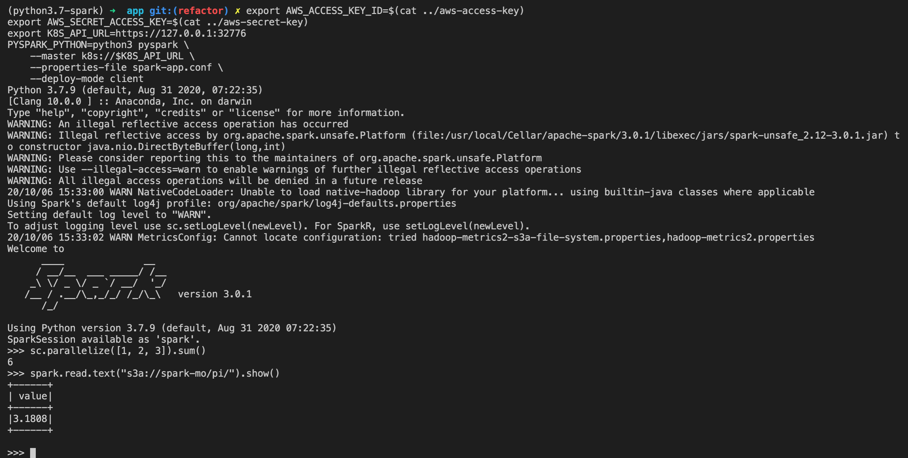
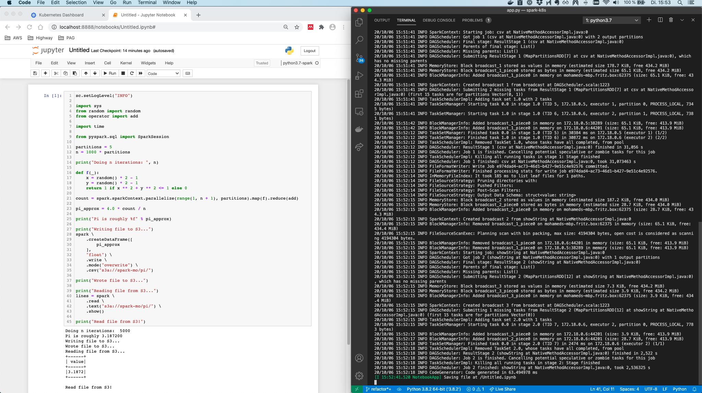
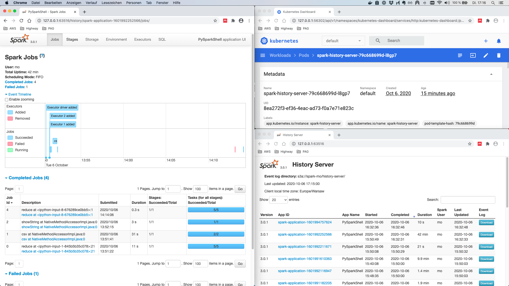
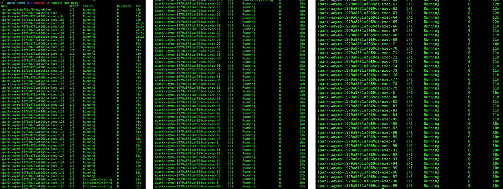

_In this post, the different deployment alternatives of Spark on Kubernetes are evaluated._
_From this, I'll outline the workflow for building and running Spark Applications as well as Spark Cluster-backed Jupyter Notebooks, both running PySpark in custom containers._ 
_It is shown how to include conda-managed Python dependencies in the image._
_Also, it is described how to deploy a notebook server running in Spark's client mode to the Kubernetes cluster._
_Workloads use AWS S3 as the data source and sink and are observable using the Spark history server._ 

# Table of Contents

- [Development Environment](#development-environment)
- [Spark Terminology](#spark-terminology)
- [Spark on K8s Deployment Alternatives](#spark-on-k8s-deployment-alternatives)
  * [Native Spark on K8s](#native-spark-on-k8s)
  * [Spark Operator for Spark on K8s](#spark-operator-for-spark-on-k8s)
  * [Spark Standalone on Kubernetes](#spark-standalone-on-kubernetes)
- [The Spark Container Image](#the-spark-container-image)
  * [Overview](#overview)
  * [Custom Spark Base Image Build](#custom-spark-base-image-build)
  * [Custom Spark Application Image](#custom-spark-application-image)
- [Running Custom Spark Applications and Notebooks on K8s](#running-custom-spark-applications-and-notebooks-on-k8s)
  * [Prerequisites](#prerequisites)
    + [Role](#role)
    + [Log files](#log-files)
    + [Secrets](#secrets)
  * [Submitting Applications in Cluster Mode](#submitting-applications-in-cluster-mode)
  * [Running Notebooks in Client Mode](#running-notebooks-in-client-mode)
    + [Overview](#overview-1)
    + [REPL Shell](#repl-shell)
    + [Jupyter Notebook](#jupyter-notebook)
- [Spark Driver UI and the History Server](#spark-driver-ui-and-the-history-server)
- [Outlook](#outlook)

# Development Environment

I set up a template repo for Spark on Kubernetes under https://github.com/MohamedKari/spark-on-k8s, corresponding to the workflow described here. I suggest taking a look at the repo before reading the text so that you can build a mental model of what we're working towards. 

My environment is the following:
- OS X 10.15.4
- Docker 19.03.13 (e. g. `brew cask install docker`)
- Minikube v1.13.1 (`brew install minikube`)
- Apache Spark 3.0.1 with PySpark (`brew install apache-spark`)
- Helm v3.3.4 (`brew install helm`)
- Minikube is serving Kubernetes v1.19.2 (`minikube --memory 8192 --cpus 4 start && kubectl version`)
- conda 4.8.3 (`brew cask install anaconda`)
- awscli 2.0.34 (`brew install awscli`) 

Further, I have created image repos on Docker hub at [mokari94/spark-base](https://hub.docker.com/repository/docker/mokari94/spark-base) and [mokari94/spark-app](https://hub.docker.com/repository/docker/mokari94/spark-app) and am logged in to the registry (`docker login`). My AWS IAM role is allowed all actions on an S3 bucket and all objects inside: 

```json
{
  "Effect": "Allow", 
  "Action": "s3:*", 
  "Resource": [ 
    "arn:aws:s3:::spark-mo", 
    "arn:aws:s3:::spark-mo/*"
  ]
}
```
()

# Spark Terminology

A central notion of a Spark application, maybe interactive or a defined job, is the _driver process_. 
The driver process could run on the developer's machine when using a spark-shell or a locally started notebook, it could run on a gateway host at the edge of a cluster, on a node in the cluster itself, or on a notebook server in the cluster.
We'll come back to where the driver process runs, in a bit.

The _driver process_ distributes a workload across a set of _executors_. 
These executors are processes, running on nodes in the cluster. 
How does the driver process allocate executors on the nodes of the cluster?
The answer is the _cluster manager_. 
Upon startup, the submitting process will instruct the cluster manager to create a certain number of executors on the cluster. 

In the so-called _client mode_, the driver is identical to the submitting process, e. g. the developer machine or a gateway machine. 
In the so-called _cluster mode_, the driver program gets deployed to the cluster by the cluster manager first, and then is started co-located to the executors, thus improving latency and being independent of the submitting machine. 

The cluster manager will then start each executor and tell them the IP and port of the driver process.
Of course, the cluster manager needs to know the hosts of the cluster and must be able to start processes on them, generally by using an agent running on the node (even tough, there it might also be possible that the cluster manager can scale out scale in the cluster itself by means of the cloud provider, as for example with [Kubernetes Cluster Autoscaler](https://github.com/kubernetes/autoscaler)).
Once all executors have reported back to the driver, the driver can distribute _tasks_ among them, e. g. tasks for data transformation. 
Instead of sending the data through the driver over the network to the executors, the driver tells the executors where to find the data on a shared file system. 
This could be an object store such as S3, a distributed file system such as HDFS, or a mounted file system.
Spark relies on data parallelism, that is each executor handles a partition of the overall input data. 
The driver process is in charge of splitting the overall input data into more or less equally-sized partitions that then get assigned to the executors. 
Instead of dumping the transformation result immediately back to the shared file system, the executors keep the result of a transformation in-memory until the driver either instructs the executors to dump it, or to aggregate the data. 
Aggregation could mean that each executor reduces the partition it "owns" to a local result and returns this local result to the driver which then reduces all received results to a global result. Or it could mean that executors need to exchange data between each other before, in the so-called shuffle procedure.

In _Spark Standalone_, a cluster is managed by the so-called Spark Master process. By default, it is listening on port 7077.
Each so-called worker node of the cluster needs to run the Spark Worker Daemon process which - upon setup - is registered with the Spark Master running on the master node on port 7077. 
Spark applications are then submitted to the cluster through the Spark Master using `spark-submit` script with the `--master spark://$SPARK_MASTER_HOST:7077` argument. Note that, even though in the following we will use the `--master` argument for non-Spark Standalone deployments, the terminology of _the_ Spark Master process and _the_ Spark Worker Nodes is specific to Spark Standalone.

# Spark on K8s Deployment Alternatives

## Native Spark on K8s
Since 2018, Spark has [native support for Kubernetes](https://issues.apache.org/jira/browse/SPARK-18278). 
For _Spark on K8s_, we assume that there is a Kubernetes cluster, serving the Kubernetes API at a given url. 
Spark applications are again submitted to the cluster using the `spark-submit` script, however this time indicating the `--master k8s://$K8S_API_URL` argument. Furthermore, one indicates `--conf spark.kubernetes.container.image` pointing to a pullable container image.
Now, instead of asking a running Spark Master to launch executor processes on pre-registered machines, 
the local submission client, running in the local process invoked by `spark-submit`, will create a Kubernetes spec with as many pods as desired executors. The spec is sent to the  Kubernetes API and handled by the Kubernetes scheduler. The scheduler schedules the pods, each of them running a single container which runs the Spark executor. 
In Spark 3.0.1, Spark Standalone as well as Spark on K8s can run handle cluster mode and client mode (with the execption of PySpark jobs running in cluster mode on Spark Standalone clusters).
This setup allows to run _custom_ Spark containers on Kubernetes without any prior setup, apart from some role stuff.

## Spark Operator for Spark on K8s
However, running `spark-submit` in an imperative manner is a bit inconsistent with the declarative `kubectl apply` paradigm. 
Therefore, the [Kubernetes Operator for Spark](https://github.com/GoogleCloudPlatform/spark-on-k8s-operator) has been developed. 
As stated in the [Kubernetes User Guide](https://kubernetes.io/docs/concepts/extend-kubernetes/operator/), Kubernetes "Operators are clients of the Kubernetes API that act as controllers for a Custom Resource". 
The operator introduces a `SparkApplication` object kind that can be specified in a yaml file and applied using kubectl.
The corresponding [controller creates the SparkApplication resource](https://github.com/GoogleCloudPlatform/spark-on-k8s-operator/blob/master/docs/design.md#architecture) by calling `spark-submit`.
So under the hood, the operator uses the above described native Spark on K8s, but wraps it in the Kubernetes-integrated API.
It can easily be installed through Helm. 
By design, the Spark Operator doesn't support client mode, because the one who calls spark-submit is the operator itself. 
Client-mode-like applications, e. g. the REPL, can still simply bypass the operator using `--master k8s://https://...`.

## Spark Standalone on Kubernetes
A bit oxymoronically, one can also deploy Spark as _Spark Standalone on Kubernetes_, e. g. using the [bitnami/spark](https://github.com/bitnami/charts/tree/master/bitnami/spark) or [stable/spark](https://github.com/helm/charts/tree/master/stable/spark) Helm charts. This has been the way to go for deploying on Kubernetes before there was native support. Instead of installing Spark Standalone on a group of e. g. EC2 instances, one would virtualize the machines as containers running on Kubernetes. In so doing, one would spark-submit with `--master spark://` (instead of `--master k8s://`) to a Spark Standalone Master which would then spawn executors on containerized worker nodes. Because Spark Standalone simply works with the nodes that have been registered, it is not possible to directly request new resources for a given job. Instead, scaling [is generally based on CPU and memory utilization](https://github.com/bitnami/charts/blob/master/bitnami/spark/templates/hpa-worker.yaml). In contrast to native K8s support, where the container is created on-demand using the container image given as a parameter to `spark-submit`, thus allowing to adapt executor context to the specific application, in Spark Standalone on Kubernetes, all applications share the same pre-deployed workers. The figure below summarizes the different deployment styles.




# The Spark Container Image

## Overview
One central advantage of using Spark on Kubernetes over Spark Standalone is that that each application can bring its container comprising all dependencies which then can integrate with the typical Kubernetes features (e. g. ConfigMaps for managing configs). 

There are two alternatives when it comes the container image: Either building the image oneself, or using an already published image. 

As said above, the images corresponding to the Helm charts of bitnami/spark (https://hub.docker.com/r/bitnami/spark/, [Dockerfile](https://github.com/bitnami/bitnami-docker-spark/blob/master/3/debian-10/Dockerfile)) and stable/spark image (k8s.gcr.io/spark:1.5.1_v3) are meant for Spark Standalone on K8s deployments. 
However, the gcr.io/spark-operator/spark-py:v3.0.0 from the spark-operator image repo ([Registry Repo](https://console.cloud.google.com/gcr/images/spark-operator/GLOBAL), Dockerfile built using the official Spark [Dockerfile for Kubernetes](https://github.com/apache/spark/blob/master/resource-managers/kubernetes/docker/src/main/dockerfiles/spark/Dockerfile)) is meant for K8s-native deployments. Even though it bears the name spark-operator in its tag, it is a bog-standard Spark image. 
Unfortunately, the dependencies it carries are not the newest (it features the Hadoop libraries in version 2.7.4) and it also doesn't come with libraries, we most certainly will need (e. g. in order to interact with AWS S3). 

The main problem of older versions in the container, is that your local brew-installed Spark installation may contain libraries in a more recent version (as is the case for me).
This means, that there most certainly will arise runtime errors when deploying in client mode from you developer machine (because the driver and the executors then run different Spark versions).

Therefore, there are three alternatives: 
1. Don't use client mode (this also means: don't use the REPL or a local Jupyter)
2. "Turn the knob on the driver side" by ensuring you have the same versions as the executors.
3. "Turn the knob on the executor side" by building a custom image

Alternative 1 is highly dissatisfying and makes developing slow.
Alternative 2 could probably work by running the spark-operator image in Docker.

However, let's go with Alternative 3 so we don't make ourselves guilty of running obselete dependencies. In the following, we will build the image off of the local Spark installation which then gets deployed. Of course, for a stable CI/CDable production, this could also happen in a build runner.

## Custom Spark Base Image Build
So, let's build the PySpark image from scratch. Actually, not really from scratch, because we use the [Dockerfile for Kubernetes]((https://github.com/apache/spark/blob/master/resource-managers/kubernetes/docker/src/main/dockerfiles/spark/Dockerfile)) maintained by the Spark community, and because we use the [Docker image tool](https://github.com/apache/spark/blob/master/bin/docker-image-tool.sh) that comes along to create the build context from a local Spark distribution. 

This could be a dedicated Spark distribution, built from source using the
[build](https://github.com/apache/spark/blob/master/build/mvn) and [distribution](https://github.com/apache/spark/blob/master/dev/make-distribution.sh) scripts. This is the way to go when using a dedicated build runner or maybe a Docker multi-stage build. Then, we could also maintain our dependencies in the [dependency configuration](https://github.com/apache/spark/blob/master/pom.xml). 

The standard Spark distribution, however, comes without S3 support, which depends on the `hadoop-aws` package. Normally, we would have to add this dependency into the `pom.xml`, but because we're not building from source, we have to add it manually. It can be found in the Maven repo. The library needs to be in the same version as all other Hadoop libraries in the Spark distribution. 

Running 
```sh
export SPARK_HOME=/usr/local/Cellar/apache-spark/3.0.1/libexec
ls $SPARK_HOME/jars/" |grep hadoop
```
reveals that the Hadoop libs in version 3.2.0 are used. The package page (https://mvnrepository.com/artifact/org.apache.hadoop/hadoop-aws/3.2.0) shows that it this depends on the `AWS Java SDK Bundle` in version 1.11.375. Older Hadoop AWS libs instead depend on the `AWS Java SDK`. So, one has to be careful here when adding these to `$SPARK_HOME/jars`.

We build the Spark Base Dockerfile by:
```sh
export REPO=mokari94
export TAG=latest
export SPARK_HOME=/usr/local/Cellar/apache-spark/3.0.1/libexec
cd $SPARK_HOME
bin/docker-image-tool.sh -r $REPO/spark-base -t $TAG -p ./kubernetes/dockerfiles/spark/bindings/python/Dockerfile build
```
This will build two pure spark image without any application-specific code, tagged `$REPO/spark-base/spark:latest` and `$REPO/spark-base/spark-py:latest`. Because we're interested in PySpark, let's use only the latter. Unfortunately, while it works with AWS ECR, pushing the image to Docker Hub fails with this tag, maybe due to the slash in the image name, since retagging works:
```sh
docker tag $REPO/spark-base/spark-py:latest $REPO/spark-base:latest
docker push $REPO/spark-base:latest
```

This is already a functioning Spark image. We could spawn it up and run a built-in example program that's already built into the image (indicated by `local://`).

```sh
# First, make sure there is a role the Submission Client can use to create our resources on the cluster and that a security token corresponding to the role gets mounted to the containers. This is esp. needed for the driver container to be able to spin up executors. 
# We can use the following spec which stems from the Operator repo, but is not specific to the Operator. 
kubectl apply -f https://raw.githubusercontent.com/GoogleCloudPlatform/spark-on-k8s-operator/master/manifest/spark-rbac.yaml

export IMAGE=mokari94/spark-base:latest
# UPDATE YOUR PORT IN THE FOLLOWING LINE (minikube cluster-info)
export K8S_API_URL=https://127.0.0.1:32776
spark-submit \
  --master k8s://$K8S_API_URL \
  --conf spark.kubernetes.container.image=$IMAGE \
  --conf spark.kubernetes.authenticate.driver.serviceAccountName=spark \
  --conf spark.kubernetes.container.image.pullPolicy=Always \
  --deploy-mode cluster \
  local:///opt/spark/examples/src/main/python/pi.py
```

However, as one can see, we launch a driver program that is located in the container's file system. While there is support to distribute an application that is local to the submission client (e. g. on the developer machine) [trough an S3-compatible object store](https://spark.apache.org/docs/latest/running-on-kubernetes.html#dependency-management), it is not ([yet?](https://issues.apache.org/jira/browse/SPARK-27936)) possible to [directly distribute the local application through Kubernetes]((https://docs.google.com/document/d/1peg_qVhLaAl4weo5C51jQicPwLclApBsdR1To2fgc48/edit)). 
 

## Custom Spark Application Image
However, the whole idea of Spark on Kubernetes is that we can deploy Spark applications as containers themselves. 

So, let's derive a custom Application container with the following properties:
- Use a custom Python App with custom dependencies (namely `numpy`)
- PySpark instead of Spark
- Read an injected S3 path from the an environment variable
- Write the result to AWS S3 at the specified path and read it back it

First, let's use the `pi.py` example as a starting point:
```sh
mkdir app && cd app
wget https://raw.githubusercontent.com/apache/spark/master/examples/src/main/python/pi.py
mv pi.py app.py
```

Let's introduce the following changes:
- employ `numpy.random.rand` instead of `random.random`
- load the required S3 path from an environment variable 
- dump the result to S3 and read it back in

To do so, replace the script with the following:
```py
# app.py
import sys
from operator import add

import time
import os

from pyspark.sql import SparkSession
import numpy as np

spark = SparkSession\
    .builder\
    .appName("PythonPi")\
    .getOrCreate()

partitions = 5
n = 1000 * partitions

print("Doing n iterations: ", n)

def f(_):
    x = np.random.rand() * 2 - 1
    y = np.random.rand() * 2 - 1
    return 1 if x ** 2 + y ** 2 <= 1 else 0

count = spark.sparkContext.parallelize(range(1, n + 1), partitions).map(f).reduce(add)

pi_approx = 4.0 * count / n

print("Pi is roughly %f" % pi_approx)

print("Writing file to S3...")
spark \
    .createDataFrame([
        pi_approx
    ],
    "float") \
    .write \
    .mode("overwrite") \
    .csv(os.getenv("S3A_DATA_PATH"))

print("Wrote file to S3...")

print("Reading file from S3...")
lines = spark \
    .read \
    .text(os.getenv("S3A_DATA_PATH")) \
    .show()

print("Read file from S3!")

spark.stop()
```

Let's manage our `numpy` dependency in an `env.yml` file using conda:
```yaml
# env.yml
name: python3.7-spark
dependencies:
  - python=3.7
  - numpy
```

Now, let's create the Docker image by deriving from our previously built Spark base image, then installing miniconda, then copying the env.yml and installing them using miniconda and finally copying the `app.py`.
```Dockerfile
# Tag: mokari94/spark-app:latest
FROM mokari94/spark-base:latest

##### SPARK FIX #####

# Because we're not using the default start-up routine, we manually need to add a name to Spark's UID 
# (which, yes, I hereby hardcode to the default of 185)
# If you don't do this, you'll have hours of debugging a 
# javax.security.auth.login.LoginException: java.lang.NullPointerException: invalid null input: name
# exception ahead of you.
RUN echo '185:x:185:0:anonymous uid:/opt/spark:/bin/false' >> /etc/passwd 

##### CONDA #####
# Prepare installation as root
USER 0

RUN apt-get update -y && \
    apt-get install -y \
        wget

RUN chmod 777 /opt
    
# Back to the default UID for Spark
USER 185

# Install
RUN wget --progress=dot:mega https://repo.anaconda.com/miniconda/Miniconda3-latest-Linux-x86_64.sh && \
    bash Miniconda3-latest-Linux-x86_64.sh -b -p /opt/miniconda3

ENV PATH="/opt/miniconda3/bin:${PATH}"
ENV PATH="/opt/miniconda3/condabin:${PATH}"

##### PYTHON PACKAGE DEPENDENCIES #####
WORKDIR /opt/spark/work-dir

COPY env.yml env.yml
RUN conda env update -f env.yml --name base

##### APP #####
ENV PYTHONUNBUFFERED=.

COPY app.py app.py

ENTRYPOINT [ "/opt/entrypoint.sh" ]
```

Now build and push this image to a public Docker hub (we could also use a private registry and specify a pull secret in the next step):
```sh
export REPO=mokari94
docker build -t $REPO/spark-app:latest .
docker push $REPO/spark-app:latest
```

Alternatively, we could build the docker container **on the virtualized Minikube node** so that the Minikube Kubernetes will find the image using `eval $(minikube docker-env) && docker build -t spark-app .`. Remember to run `eval $(minikube docker-env)` whenever you enter a fresh terminal window, if you want to update the Docker image. Also be careful, to set the imagePullPolicy in the next step correctly.


# Running Custom Spark Applications and Notebooks on K8s

## Prerequisites
So now, all we have done is building a custom Spark application image. However, before we can run it, we need to make sure 
- there is a Spark service account the driver can assume to create the executor pods, 
- there in an S3 bucket and prefix for the executor-created log files, so we can inspect what Spark is doing, 
- there are credentials for AWS accessible to the driver and the executors through Kubernetes Secrets, so the log files can be dumped to S3, and, in particular, so that we can read and write our data from and to S3. 

### Role

If you haven't done this above, to create the service account for spark, we can reuse a spec, by the Spark operator:

```sh
kubectl apply -f https://raw.githubusercontent.com/GoogleCloudPlatform/spark-on-k8s-operator/master/manifest/spark-rbac.yaml
```

In the spark-submit call, we will indicate the service account as follows:

```sh
--conf spark.kubernetes.authenticate.driver.serviceAccountName=spark
```

### Log files

Let's create the Spark log path. We must make sure that there is at least a single file under the prefix we use (otherwise we get a FileNotFound exception in some situations, esp. when, later on, using the History Server):
```sh
aws s3 mb s3://spark-mo/
touch dummy
aws s3 cp dummy s3://spark-mo/history-server/
rm dummy
```

In the spark-submit call, we will indicate the log args as follows:

```sh
--conf spark.eventLog.enabled=true \
--conf spark.eventLog.dir=s3a://spark-mo/history-server/
```

### Secrets

We populate the AWS credentials from a Kubernetes secret into the container using the [environment variables Spark feature](https://spark.apache.org/docs/latest/running-on-kubernetes.html#secret-management). In order to store the secrets as a Kubernetes secret, Put the `AWS_ACCESS_KEY_ID` into a file named `aws-access-key` and the `AWS_SECRET_KEY` into a file named `aws-secret-key`.
Make sure that there is not trailing line break.

```sh
kubectl create secret generic aws-secrets --from-file=aws-access-key --from-file=aws-secret-key
```

In the spark-submit call, we will indicate the secrets as follows:

```sh
--conf spark.kubernetes.driver.secretKeyRef.AWS_ACCESS_KEY_ID=aws-secrets:aws-access-key \
--conf spark.kubernetes.driver.secretKeyRef.AWS_SECRET_ACCESS_KEY=aws-secrets:aws-secret-key \
--conf spark.kubernetes.executor.secretKeyRef.AWS_ACCESS_KEY_ID=aws-secrets:aws-access-key \
--conf spark.kubernetes.executor.secretKeyRef.AWS_SECRET_ACCESS_KEY=aws-secrets:aws-secret-key
```

The above notation says to populate the `aws-access-key` value from the `aws-secrets` Kubernetes secret into an environment variable called `AWS_ACCESS_KEY_ID`. Should you rely on temporary role session tokens on the AWS side, this also could be [taken into account here](https://hadoop.apache.org/docs/r3.2.0/hadoop-aws/tools/hadoop-aws/index.html#Using_Session_Credentials_with_TemporaryAWSCredentialsProvider). 

However, for the Hadoop AWS and the AWS SDK to be able to access S3, we included in our Spark Base Image, to find be able to actually make requests to the AWS API, we need to indiated the region, your bucket was created. As the region I use, Frankfurt, only offers the newer v4 Authentication Signature (v2 is legacy, anyways). it is needed to set enable Signature v4 by extra java options for driver and executor. Otherwise, we'll get a very non-specific _Bad Request_ error. Finally, we need to set the AWS credentials. 

```sh
--conf spark.hadoop.fs.s3a.endpoint=s3.eu-central-1.amazonaws.com \
--conf spark.executor.extraJavaOptions=-Dcom.amazonaws.services.s3.enableV4=true \
--conf spark.driver.extraJavaOptions=-Dcom.amazonaws.services.s3.enableV4=true
```


## Submitting Applications in Cluster Mode

Finally, let's get to action:
```sh
export IMAGE=mokari94/spark-app:latest
export K8S_API_URL=https://127.0.0.1:32776
export S3A_DATA_PATH=s3a://spark-mo/pi/
spark-submit \
    --master k8s://$K8S_API_URL \
    --conf spark.kubernetes.authenticate.driver.serviceAccountName=spark \
    --conf spark.kubernetes.container.image=$IMAGE \
    --conf spark.kubernetes.container.image.pullPolicy=Always \
    --conf spark.executor.instances=2 \
    --conf spark.executor.cores=1 \
    --conf spark.task.maxFailures=3 \
    --conf spark.executor.memory=1g \
    --conf spark.driver.memory=1g \
    --conf spark.kubernetes.driver.secretKeyRef.AWS_ACCESS_KEY_ID=aws-secrets:aws-access-key \
    --conf spark.kubernetes.driver.secretKeyRef.AWS_SECRET_ACCESS_KEY=aws-secrets:aws-secret-key \
    --conf spark.kubernetes.executor.secretKeyRef.AWS_ACCESS_KEY_ID=aws-secrets:aws-access-key \
    --conf spark.kubernetes.executor.secretKeyRef.AWS_SECRET_ACCESS_KEY=aws-secrets:aws-secret-key \
    --conf spark.hadoop.fs.s3a.endpoint=s3.eu-central-1.amazonaws.com \
    --conf spark.executor.extraJavaOptions=-Dcom.amazonaws.services.s3.enableV4=true \
    --conf spark.driver.extraJavaOptions=-Dcom.amazonaws.services.s3.enableV4=true \
    --conf spark.eventLog.enabled=true \
    --conf spark.eventLog.dir=s3a://spark-mo/history-server/ \
    --conf spark.kubernetes.driverEnv.S3A_DATA_PATH=$S3A_DATA_PATH \
    --conf spark.executorEnv.S3A_DATA_PATH=$S3A_DATA_PATH \
    --deploy-mode cluster \
    local:///opt/spark/work-dir/app.py
```

After submitting you application, you can easily observe driver and executor creation through the Kubernetes dashboard (``minikube dashboard``) and follow the log output. The driver's log looks this:



In S3 under `s3a://spark-mo/pi/`, there should be a new or updated set of result CSVs and an empty _SUCCESS flag file. Also, under `s3a://spark-mo/history-server/` there a should be new log file.

Because this spark-submit call is a bit bulky, we shorten it a bit using a properties file, e. g. named spark-app.conf:

```conf
spark.kubernetes.container.image                                mokari94/spark-app:latest
spark.eventLog.dir                                              s3a://spark-mo/history-server/
spark.hadoop.fs.s3a.endpoint                                    s3.eu-central-1.amazonaws.com
spark.kubernetes.driverEnv.S3A_DATA_PATH                        s3a://spark-mo/pi/
spark.executorEnv.S3A_DATA_PATH                                 s3a://spark-mo/pi/
spark.kubernetes.authenticate.driver.serviceAccountName         spark
spark.kubernetes.container.image.pullPolicy                     Always
spark.executor.instances                                        2
spark.executor.cores                                            1
spark.task.maxFailures                                          3
spark.executor.memory                                           1g
spark.driver.memory                                             1g
spark.kubernetes.driver.secretKeyRef.AWS_ACCESS_KEY_ID          aws-secrets:aws-access-key
spark.kubernetes.driver.secretKeyRef.AWS_SECRET_ACCESS_KEY      aws-secrets:aws-secret-key
spark.kubernetes.executor.secretKeyRef.AWS_ACCESS_KEY_ID        aws-secrets:aws-access-key
spark.kubernetes.executor.secretKeyRef.AWS_SECRET_ACCESS_KEY    aws-secrets:aws-secret-key
spark.executor.extraJavaOptions                                 -Dcom.amazonaws.services.s3.enableV4=true
spark.driver.extraJavaOptions                                   -Dcom.amazonaws.services.s3.enableV4=true
spark.eventLog.enabled                                          true
```

and adapt spark-submit as follows:

```sh
export K8S_API_URL=https://127.0.0.1:32776
spark-submit \
    --master k8s://$K8S_API_URL \
    --properties-file spark-app.conf \
    --deploy-mode cluster \
    local:///opt/spark/work-dir/app.py
```


Doing the same thing through the operator is straight-forward. Helm-install it, manually translate your the spark-app.conf into a Kubernetes-Manifest spark-app.yaml and run `kubectl apply -f spark-app.yaml` which will, under the hood, do the same thing, we just did above.

## Running Notebooks in Client Mode

### Overview
Remember that it is important to have the same Spark distributions on your Notebook server (in this case, your developer as on the executors) and your local machine to run a notebook.
We ensured this by building our local distribution into the Spark Base Image. 

The more production-ready alternatives would be either

1. to clone the Spark repo, 
2. build a Spark distribution from source, 
3. build a Spark Base Docker image using this Spark distribution, and
4. running this specific distribution on the developer machine.

However, for the moment, let's go with the original setup where typing `realpath $(which spark-submit)` on the will show the path to the same Spark distribution that was built into the Spark Base image. While Spark itself is written in Scala and compiled to bytecode that is always executed in a JVM, PySpark is a Python application that exposes a Python API wrapping the Java API used to communicate with the JVM. It is essential that not only the driver's and executor's Spark environment in terms of version and dependencies match, but also the Python environment.

So, let's add the juypter and notebook dependencies to the `env.yml`:
```sh
# We use the env.yml for the developer machine's environment, 
# and in the Spark App image.
cat <<EOF > env.yml
name: python3.7-spark
dependencies:
  - python=3.7
  - jupyter
  - notebook
  - numpy
EOF

conda env update -f env.yml

python -m ipykernel install --user --name python3.7-spark
```

### REPL Shell

When running the driver on the cluster, Kubernetes will make sure that the secrets defined in Spark submit are populated to the driver. 
Now that we're controlling the driver ourselves, we need to populate the secrets ourselves.
To make sure, the executors run python3, set the env var `PYSPARK_PYTHON=python3`.
Now, let's see if our local developer machine can play the same role as a driver on the cluster:

```sh
source activate python3.7-spark
export AWS_ACCESS_KEY_ID=$(cat ../aws-access-key)
export AWS_SECRET_ACCESS_KEY=$(cat ../aws-secret-key)
export K8S_API_URL=https://127.0.0.1:32776
PYSPARK_PYTHON=python3 spark-submit \
    --master k8s://$K8S_API_URL \
    --properties-file spark-app.conf \
    --deploy-mode client \
    app.py
```

This should behave like it did on the driver pod previously.

However, we actually don't want to submit a ready application, but instead run an interactive driver program. 
There, instead of  spark-submit, we use `pyspark` (the equivalent in Scala is more meaningfully called _spark-shell_). 
This will always run in client mode, however - by default - run a REPL shell. 

```sh
source activate python3.7-spark
export AWS_ACCESS_KEY_ID=$(cat ../aws-access-key)
export AWS_SECRET_ACCESS_KEY=$(cat ../aws-secret-key)
export K8S_API_URL=https://127.0.0.1:32776
PYSPARK_PYTHON=python3 pyspark \
    --master k8s://$K8S_API_URL \
    --properties-file spark-app.conf
```

It should look something like this:



### Jupyter Notebook
Finally, let's run this in Jupyter by instructing pyspark through environment variables to use run `jupyter` and pass the `notebook .` args:
```sh
source activate python3.7-spark
export AWS_ACCESS_KEY_ID=$(cat ../aws-access-key)
export AWS_SECRET_ACCESS_KEY=$(cat ../aws-secret-key)
export K8S_API_URL=https://127.0.0.1:32776
PYSPARK_PYTHON=python3 PYSPARK_DRIVER_PYTHON=jupyter PYSPARK_DRIVER_PYTHON_OPTS="notebook ." pyspark \
    --master k8s://$K8S_API_URL \
    --properties-file spark-app.conf
```

Create a new notebook with as `python3.7-spark` as an environment.

Copy the following into a cell and run it:
```py
sc.setLogLevel("INFO")

import sys
from random import random
from operator import add

import time

from pyspark.sql import SparkSession

partitions = 5
n = 1000 * partitions

print("Doing n iterations: ", n)

def f(_):
    x = random() * 2 - 1
    y = random() * 2 - 1
    return 1 if x ** 2 + y ** 2 <= 1 else 0

count = spark.sparkContext.parallelize(range(1, n + 1), partitions).map(f).reduce(add)

pi_approx = 4.0 * count / n

print("Pi is roughly %f" % pi_approx)

print("Writing file to S3...")
spark \
    .createDataFrame([
        pi_approx
    ],
    "float") \
    .write \
    .mode("overwrite") \
    .csv("s3a://spark-mo/pi/")

print("Wrote file to S3...")

print("Reading file from S3...")
lines = spark \
    .read \
    .text("s3a://spark-mo/pi/") \
    .show()

print("Read file from S3!")
```

As seen below, _print_ statements are displayed in the notebook but the driver log is given in the terminal window. 



Notice, that the code from within the Jupyter notebook is now actually marshaled and sent over to the executors on the cluster. 
Of course, if you now depend on a package in your Python code, it has to be part of the Spark App container so each executor can use it.


Also note, that now, since - the driver is running on the developer machine, without further ado, you can check the driver's Spark UI, by default running on http://localhost:4040/.

Alternative to the `pyspark` command, after starting a blank notebook, one could use
```py
from pyspark import SparkConf, SparkContext
conf = SparkConf()
conf.setMaster("k8s://...")
# conf.set("...", "...")

SparkContext(conf=conf)
``` 

However, we will build the Jupyter notebook server into a Docker image and therefore it makes sense to already exercise calling it from the command line. Why do we need to run it as a container anyway?

Now, that we have see how all of this works, there's unfortunately a show-stopper to the setup. 
The driver needs to be network-addressable from the executors. 
While this is the case when running on Minikube, the Jupyter notebook server, in general, won't be network-addressable when running on a real cluster at AWS, at least if we're running it on the developer machine. Of course, we could run the notebook server on a gateway server in the same AWS VPC, however why not run the notebook server on Kubernetes itself?

While we could build a separate Docker image for the notebooks, let's make our lifes easier and build notebook support into our Spark App image. This singlehandedly ensures that the driver running in the Jupyter Notebook container and the executors run the exact same Spark and Python dependencies. Ahh, containers are just beautiful.. 

So, what do we need in order to run Jupyter in a Docker container?
Spark? Check. Python? Check (through conda)! The Python `jupyter` and `notebook` PyPI packages? Check!!! 

The following Kubernetes manifest will spin up a single Pod running the notebook server (PRs on Github welcome :) ). 

```yaml
# spark-notebook.yaml
apiVersion: v1
kind: Pod
metadata:
  name: spark-notebook
  labels:
    role: spark-notebook
spec:
  serviceAccountName: spark
  containers:
    - name: spark-notebook
      image: mokari94/spark-app:latest
      env:
        - name: HOME # overwrites HOME so Jupyter will for sure have permission
          value: "/tmp/.jupyter"
        - name: PYSPARK_DRIVER_PYTHON
          value: "jupyter"
        - name: PYSPARK_DRIVER_PYTHON_OPTS
          value: "notebook . --ip 0.0.0.0"
        - name: AWS_ACCESS_KEY_ID
          valueFrom: 
            secretKeyRef:
              name: aws-secrets
              key: aws-access-key
        - name: AWS_SECRET_ACCESS_KEY
          valueFrom: 
            secretKeyRef:
              name: aws-secrets
              key: aws-secret-key
      command: [
        /opt/spark/bin/pyspark ,
        --master, k8s://https://kubernetes:443,
        --conf, spark.jars.ivy=/tmp/.ivy,
        --conf, spark.kubernetes.container.image=mokari94/spark-app:latest,
        --conf, spark.driver.port=40694,
        --conf, spark.driver.host=spark-notebook-service,
        --conf, spark.kubernetes.driver.pod.name=spark-notebook,
        --properties-file, /etc/config/spark-notebook.conf
      ]
      # spark.driver.host sets the name of the headless service
      # executors will need to send their communication to the driver process
      # which we want to be on the Jupyter server.
      # However, pod names are not directly resolvable to the host.
      # So instead, we use a service that then routes to the pod.
      # Instead of using a "standard" service that can loadbalance across multiple pods, 
      # we use a headless service that simply passes through requests to the pod that matches the selector.

      ports:
      - containerPort: 8888
      - containerPort: 40694

      volumeMounts:
      - name: config-volume
        mountPath: /etc/config/

  volumes:
    - name: config-volume
      configMap:
        name: spark-notebook-configmap
---
apiVersion: v1
kind: Service
metadata:
  name: spark-notebook-service
spec:
  clusterIP: None
  selector:
    role: spark-notebook
  ports:
    - protocol: TCP
      port: 8888
      targetPort: 8888
      name: jupyter-web-ui
    - protocol: TCP
      port: 40694
      targetPort: 40694
      name: spark-driver-port
```

Run the notebook using 
```sh
kubectl apply -f spark-notebook.yaml
```

Use the `minikube service` or `kubectl port-forward service/spark-notebook-service 8888:8888` command to access the notebook through your browser under `localhost:8888`.

The spark driver running inside the notebook container will be able to spin up executors because the manifest assigns the spark service role to the pod. This mounts the token for the API server at `/var/run/secrets/kubernetes.io/serviceaccount/token`. In order to access the notebook, copy the token itself from the pod's log. Also remember that the pod's local file system will be deleted when the pod is deleted, so using git could be a good idea. 

# Spark Driver UI and the History Server
By using port-forwarding, we could also check the driver's Spark UI for jobs submitted to Spark on K8s in cluster-mode or for the cluster-deployed notebook server. 
However the central problem is that the Spark UI is coupled to the Spark driver process, meaning that once the process ends, the UI is no longer served.
While we can still access the raw log files themselves in the AWS S3 bucket we configure in the `spark-submit` or `pyspark` call, accessing them visually through the UI is bit more handy, isn't it.

Here, the history server comes to rescue.
It is deployed as a separate component, not necessarily but possibly on the same K8s cluster. It' basically just a visual log file explorer, that parses and displays the logs stored - in our case - in S3 by the driver and executors. Therefore, it is necessary that the history server as well as the driver and executors have access to the same AWS S3 bucket, so that the latters can write to it and that the former can read from it.

In theory, we can use the Spark Base image to run the History server, because we built in the dependencies (hadoop-aws and aws-java-sdk-bundle) for AWS access. 
However, when actually doing so it throws a `javax.security.auth.login.LoginException: java.lang.NullPointerException: invalid null input: name` due to the fact that the default Spark user in the linux container is unnamed. In the App image, we have added the line
```sh 
echo '185:x:185:0:anonymous uid:/opt/spark:/bin/false' >> /etc/passwd 
```
to circumvent this. So let's simply reuse the app image.

To deploy the history server, let's use Helm. 

First, make the official Helm chart repo available.

```sh
helm repo add stable https://kubernetes-charts.storage.googleapis.com
```

Let's have a look at a config template:
```sh
helm show values stable/spark-history-server > history-server-config.yaml
```

From this, let's use the following subset:
```yaml
image:
  repository: mokari94/spark-app
  tag: latest
  pullPolicy: Always

environment:
  SPARK_HISTORY_OPTS:
    -Dcom.amazonaws.services.s3.enableV4=true

nfs: 
  enableExampleNFS: false

pvc: 
  enablePVC: false

s3:
  enableS3: true
  enableIAM: false
  secret: aws-secrets
  accessKeyName: aws-access-key
  secretKeyName: aws-secret-key
  logDirectory: s3a://spark-mo/history-server/
  endpoint: s3.eu-central-1.amazonaws.com
```

Now, let's deploy the history server using: 
```sh
helm install -f history-server-config.yaml spark-history-server stable/spark-history-server
```

and finally, expose it to the outside using
```sh
minikube service spark-history-server
```




# Outlook
In this post, we've examined how to setup a fully containerized, PySpark-based, History-Server-monitored workflow for submitting Spark applications and interactively running Spark-backed notebooks on Kubernetes. While understanding and elaborating on the factors at play made this a quite lengthy post, I think the [resulting GitHub repo](https://github.com/MohamedKari/spark-on-k8s). I always strive to avoid trivial examples that do not capture the complexities of going into the real world of bordering systems, large data sets, networks, code dependencies, etc. So, instead of using toy examples that are incommensurable with real problems, I still present toy examples that do not distract from the big picture however while _respecting the challenging facets_ of the real world. There are of course still quite some relaxations in the previous remarks incl. 
- not building from source and therefore relying on a highly fragile manual dependency management (it would be interesting to have a look at Docker Multistage builds for this).
- assuming a dedicated Kubernetes cluster, thus ignoring roles and the concept of Namespaces and installing everything to default,
- not regarding security (e. g. by using TLS)
- not taking a look at integrations, e. g. with [Databricks' Koalas library](https://github.com/databricks/koalas) for a pandas-like user experience on Spark.

In the next post, we'll see how to take everything learned so far together, to transform 1 Terabyte of the Waymo Open Dataset, consisting of about 1000 driving sequences in protobuf format, to the RGB camera frames and labels only, using 150 executors running on an EKS cluster for consumption. 

